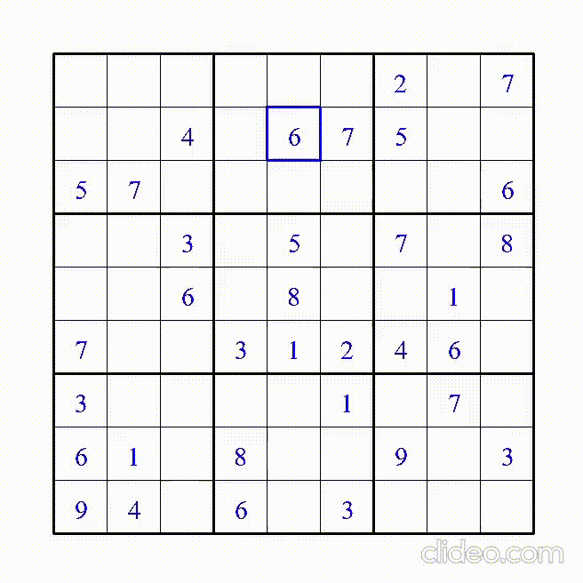

# Sudoku

Created a Sudoku game in python and implemented a backtracking algorithm to solve the game and made a visualization of its workflow using pygame

**Some Important Points**

- You need to have python and pygame installed on your computer to run the code. To install Pygame, head over to your command prompt or terminal and type:

```bash
                                pip install pygame
```

- The unsolved sudoku configurations are pulled from an API called 'sugoku'
- Since it uses an API, you need an internet connection to run the program
- press 'r' if you want to reset the game
- The game can be played like any regular Sudoku game. However, if you don't feel like solving and just want to see how the backtracking algorithm finds the solution, you can simply press 's' at any point and the algorithm will start doing its magic with some cool visualization
- I hope you like it!


